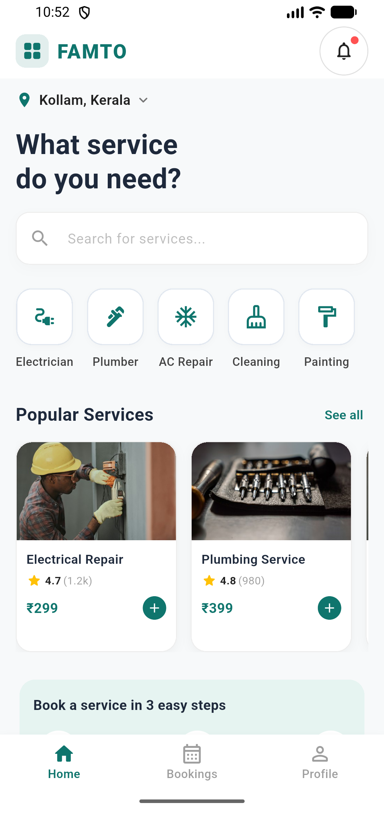
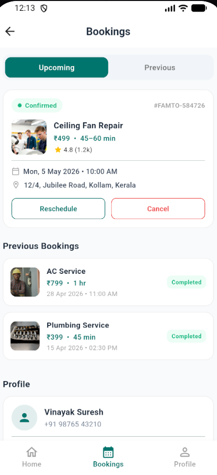

<p align="center">
  
</p>

<h1 align="center">Famto Mini Service Booking</h1>

<p align="center">
  Book trusted home services in a few taps.
</p>

<p align="center">
  
  
  
</p>

## Introduction

Famto Mini Service Booking is a Flutter mobile app for finding and booking everyday home services such as electrician, plumber, AC repair, cleaning and painting. It was built as a mini service-booking app with a clean teal-themed UI and a complete booking flow, from browsing services to confirmation and booking history.

## What is this app about?

Users pick a location, search or browse service categories, check ratings and prices, choose a date and time, and confirm a booking. They can then view upcoming and previous bookings, reschedule or cancel them, and manage their profile.

## Screenshots

<p align="center">
  
  &nbsp;&nbsp;
  
</p>

<p align="center"><b>Home</b> &nbsp;&nbsp;&nbsp;&nbsp;&nbsp;&nbsp;&nbsp;&nbsp;&nbsp;&nbsp;&nbsp;&nbsp;&nbsp;&nbsp;&nbsp;&nbsp;&nbsp;&nbsp;&nbsp;&nbsp;&nbsp;&nbsp;&nbsp;&nbsp;&nbsp;&nbsp; <b>Bookings &amp; Profile</b></p>

## Features

- **Home screen:** location selector, service search, category shortcuts and a notification bell
- **Popular services:** horizontally scrolling cards with image, rating, review count and price
- **Service categories:** Electrician, Plumber, AC Repair, Cleaning and Painting
- **Service details:** hero image, pricing, ratings and an Add / Book action
- **Booking flow:** date and time pickers with a selected-service summary
- **Booking confirmation:** success header, service details card and price breakdown
- **My Bookings:** Upcoming and Previous tabs, status badges (Confirmed, Completed), and Reschedule / Cancel actions
- **Profile & account:** user details and account management with logout
- **Authentication screens:** login and registration with form validation
- **Bottom navigation:** Home, Bookings and Profile
- **State management:** `provider`, with loading, error and empty states

## Tech Stack

- **Framework:** Flutter (Material 3)
- **Language:** Dart
- **State management:** Provider

## Project Structure

```text
lib/
├── main.dart
├── models/        # Data models (service_model.dart)
├── providers/     # State management (service_provider.dart)
└── screens/       # Home, category, details, booking, confirmation,
                   # bookings, login and register screens
```

## Getting Started

```bash
git clone https://github.com/Viper-rgb/femto_mini_booking_app.git
cd femto_mini_booking_app
flutter pub get
flutter run
```

## Build an APK

```bash
flutter build apk --release
```

The APK is generated at `build/app/outputs/flutter-apk/app-release.apk`.
